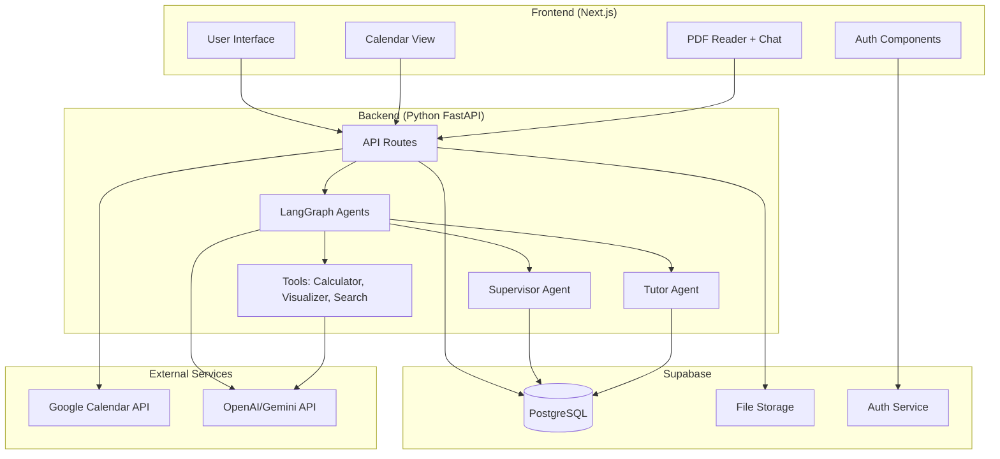

# Project Plan: Lernkompanien (Adaptive Learning Assistant)

## Executive Summary

**Lernkompanien** is an AI-powered learning ecosystem that supports students not only administratively (planning) but also content-wise (tutoring) and psychologically (proactivity). The system dynamically adapts to the actual learning progress and personality of the user.

### Core Value Proposition
- **Administrative Relief**: Intelligent calendar management and learning plan creation
- **Content Support**: AI tutor that explains lecture materials and answers questions
- **Psychological Motivation**: Proactive communication and adaptive learning paths
- **Personalization**: Adapts to learning style, personality, and actual progress

---

## 1. Core Features

### A. Intelligent Content Analysis & Onboarding

#### Multi-Format Upload
- Users upload lecture slides, scripts, or notes
- Supported formats: PDF, PowerPoint, Markdown, Text files
- Storage: Supabase Storage with metadata tracking

#### Context Understanding (Multimodal Analysis)
- **PDF to Image Conversion**: Convert each PDF page to image (JPG/PNG) using `pdf2image`
- **Multimodal Analysis**: Send each page image to multimodal LLM (e.g., OpenAI GPT-4o) with structured prompt
- **Structured JSON Response**: LLM returns structured data per page:
  - Content summary
  - Key terms and concepts
  - Potential exam questions
  - Diagram descriptions (what's visible in charts/graphs)
- **Direct Storage**: Store structured JSON in Supabase, linked to page number
- No vector embeddings or RAG - direct structured data access

#### Personality Quiz (Onboarding)
- **Learning Style Analysis**:
  - Linear (structured, sequential) vs. Iterative (jumping/repeating)
  - Visual vs. Textual preference
  - Pace preference (fast overview vs. deep dive)
- **Agent Persona Selection**:
  - Strict (disciplined, goal-oriented)
  - Humorous (light-hearted, encouraging)
  - Buddy (casual, supportive friend-like)

**Technical Implementation**:
- Onboarding flow in Next.js with form components
- Store preferences in Supabase `user_preferences` table
- Use preferences to customize agent prompts and behavior

### B. Proactive Calendar Management (The "Engine")

#### Google Calendar Sync
- Bidirectional synchronization with Google Calendar API
- System reads fixed appointments (work, leisure)
- Automatically blocks learning units into free time slots
- Respects user-defined learning time preferences

#### Dynamic Planning Logic
- Create learning plan based on:
  - Exam dates and deadlines
  - Subject weighting and importance
  - Available time slots
  - User's learning pace and capacity
- Algorithm considers:
  - Topic difficulty
  - Prerequisites and dependencies
  - Optimal spacing for retention (spaced repetition)

#### Reality Check (Confirmation Feature)
- **Method 1**: "Learning unit completed" button in UI
- **Method 2**: Calendar interaction:
  - Delete event = not completed
  - Move event = reschedule for later
- System tracks completion status and adjusts plan accordingly

**Technical Implementation**:
- Google Calendar API OAuth integration
- Background cron job (Vercel Cron or Supabase Edge Functions)
- State machine in LangGraph for plan adjustments

### C. Learning Progress Supervisor (Backend Logic)

The "Supervisor" agent runs in the background and monitors learning progress.

#### Should-Is Comparison
- Compares planned progress with:
  - Actually completed units
  - Quiz results and comprehension scores
  - Time spent vs. planned time

#### Adaptive Adjustment
- If topic not understood (low "penetration" score):
  - Automatically schedules review sessions
  - Delays subsequent topics
  - Adjusts difficulty or approach
- If ahead of schedule:
  - Suggests additional practice
  - Moves up deadlines if possible

**Technical Implementation**:
- LangGraph state machine with Supervisor node
- Periodic evaluation (every 24 hours or after each session)
- Database triggers for real-time updates

### D. In-App Reader (Split-Screen Study Mode)

The central learning tool for active study sessions.

#### Layout
- **Left Panel**: PDF/lecture slide viewer (react-pdf)
- **Right Panel**: Chat interface with AI tutor
- Resizable panels using `react-resizable-panels`

#### Auto-Description
- Agent proactively summarizes current slide content
- Triggered when user navigates to new page
- Context-aware explanations based on user's progress

#### Interactive Q&A
- User can ask questions about current slide
- Agent retrieves structured analysis data directly from database (by page number)
- Uses pre-analyzed content summary, key terms, and diagram descriptions
- Maintains conversation context within session

#### Comprehension Check
- Agent asks follow-up questions: "Do you understand why X happens?"
- Ensures topic mastery before proceeding
- Tracks comprehension scores per topic

#### Flashcard Generation (CSV Export)
- When user navigates to new page:
  - Previous page conversation + slide content sent to flashcard agent
  - Generates 1-2 flashcards in CSV format
- Aggregated export at session end or on-demand
- Compatible with Anki import format

**Technical Implementation**:
- Track current page number in React state
- Send page change events to backend
- LangGraph agent for flashcard generation
- CSV export endpoint

### E. Proactive Communication (Notification System)

#### Conversation Initiation
- Agent doesn't wait for user input
- Proactive messages: "Hey, according to your plan, Statistics is scheduled today. Should we start?"
- Push notifications via browser API or email

#### Intervention
- When Supervisor detects plan slippage:
  - Chat invitation via Companion Agent
  - "We need to adjust your plan, you're falling behind."
- Suggests concrete solutions and alternatives

**Technical Implementation**:
- WebSocket or Server-Sent Events for real-time updates
- Notification API for browser notifications
- Scheduled checks via cron jobs

### F. Long-term Memory

- Agent remembers past sessions
- Context: "Last time you had difficulties with topic X, should we review it briefly?"
- Stores conversation history and learning patterns
- Uses for personalized recommendations

**Technical Implementation**:
- Supabase database for conversation history
- Direct database queries for past session retrieval (by course, date, topic)
- Context window management for LLM

### G. Integrated Tools & Skills

#### Calculator Module
- Quick calculations within chat
- No app switching required
- Handles mathematical expressions and formulas

#### Visualization Tool ("Nano Banana Pro")
- Generate infographics or diagrams
- Explain complex concepts visually
- Flowcharts, process diagrams, concept maps

#### Web Search
- Find current information or examples
- Not limited to uploaded materials
- Integrates search results into explanations

#### PDF/PPT Processing (Multimodal Ingestion Workflow)
- **PDF Upload**: User uploads PDF file
- **Image Conversion**: Convert each PDF page to image (JPG/PNG) using `pdf2image`
- **Multimodal Analysis**: Send each page image to multimodal LLM API (OpenAI GPT-4o) with strict prompt
- **Structured Output**: LLM returns JSON with:
  - Content summary
  - Key terms and concepts
  - Potential exam questions
  - Diagram/chart descriptions
- **Storage**: Store structured JSON in Supabase, linked to page number and course material

**Technical Implementation**:
- LangChain tools for each capability
- Tool routing in LangGraph agent
- External APIs for visualization (e.g., Mermaid, Chart.js)

---

## 2. Tech Stack & Architecture

### Frontend Stack

| Component | Technology | Version | Purpose |
|-----------|-----------|---------|---------|
| Framework | Next.js | 14/15 (App Router) | SSR, API Routes, optimal performance |
| Language | TypeScript | Latest | Type safety, better DX |
| Styling | Tailwind CSS | Latest | Utility-first CSS |
| UI Components | shadcn/ui | Latest | Pre-built, accessible components |
| PDF Rendering | react-pdf | Latest | Display PDFs in browser |
| Calendar UI | react-big-calendar | Latest | Calendar visualization |
| Panel Layout | react-resizable-panels | Latest | Split-screen resizable panels |
| State Management | React Context / Zustand | Latest | Global state (optional) |
| Forms | React Hook Form | Latest | Form handling |
| HTTP Client | Fetch API / Axios | Built-in | API communication |

### Backend Stack

| Component | Technology | Version | Purpose |
|-----------|-----------|---------|---------|
| Framework | FastAPI | Latest | Python API framework |
| AI Orchestration | LangGraph | Latest | Agent state machines |
| AI Framework | LangChain | Latest | LLM integration, tools |
| LLM Provider | OpenAI / Google Gemini | Latest | Primary LLM |
| PDF Processing | pdf2image | Latest | Convert PDF pages to images |
| Image Processing | Pillow (PIL) | Latest | Image manipulation and format conversion |
| Multimodal LLM | OpenAI GPT-4o | Latest | Image analysis and structured extraction |
| Task Queue | Celery (optional) | Latest | Background jobs |
| API Server | LangServe | Latest | Serve LangGraph agents |

### Database & Infrastructure

| Component | Technology | Purpose |
|-----------|-----------|---------|
| Database | Supabase (PostgreSQL) | Primary database |
| Storage | Supabase Storage | File uploads (PDFs, images) |
| Authentication | Supabase Auth | User management, OAuth |
| Real-time | Supabase Realtime | Live updates |
| Edge Functions | Supabase Edge Functions | Serverless functions |

### Deployment

| Component | Platform | Purpose |
|-----------|----------|---------|
| Frontend | Vercel | Next.js deployment |
| Backend API | Railway / Render | Python FastAPI deployment |
| Database | Supabase Cloud | Managed PostgreSQL |

### Architecture Diagram



---

## 3. Database Schema

### Core Tables

#### `users`
```sql
- id (uuid, primary key)
- email (text, unique)
- created_at (timestamp)
- updated_at (timestamp)
- google_calendar_token (encrypted text)
- google_calendar_refresh_token (encrypted text)
```

#### `user_preferences`
```sql
- id (uuid, primary key)
- user_id (uuid, foreign key -> users)
- learning_style (enum: 'linear', 'iterative')
- agent_persona (enum: 'strict', 'humorous', 'buddy')
- preferred_study_times (jsonb) -- e.g., ["monday:18:00-20:00", "wednesday:19:00-21:00"]
- created_at (timestamp)
- updated_at (timestamp)
```

#### `courses`
```sql
- id (uuid, primary key)
- user_id (uuid, foreign key -> users)
- name (text) -- e.g., "Marketing 101"
- description (text, nullable)
- exam_date (date, nullable)
- created_at (timestamp)
- updated_at (timestamp)
```

#### `course_materials`
```sql
- id (uuid, primary key)
- course_id (uuid, foreign key -> courses)
- file_name (text)
- file_path (text) -- Supabase Storage path
- file_type (text) -- 'pdf', 'pptx', 'md'
- page_count (integer)
- uploaded_at (timestamp)
```

#### `learning_units`
```sql
- id (uuid, primary key)
- course_id (uuid, foreign key -> courses)
- topic_name (text)
- planned_date (date)
- planned_time (time)
- actual_date (date, nullable)
- actual_time (time, nullable)
- status (enum: 'planned', 'completed', 'skipped', 'rescheduled')
- comprehension_score (float, nullable) -- 0.0 to 1.0
- notes (text, nullable)
- created_at (timestamp)
- updated_at (timestamp)
```

#### `conversations`
```sql
- id (uuid, primary key)
- user_id (uuid, foreign key -> users)
- course_id (uuid, foreign key -> courses, nullable)
- session_type (enum: 'study', 'planning', 'general')
- started_at (timestamp)
- ended_at (timestamp, nullable)
- metadata (jsonb) -- e.g., current_page, topic
```

#### `messages`
```sql
- id (uuid, primary key)
- conversation_id (uuid, foreign key -> conversations)
- role (enum: 'user', 'assistant', 'system')
- content (text)
- page_number (integer, nullable) -- for study sessions
- created_at (timestamp)
```

#### `flashcards`
```sql
- id (uuid, primary key)
- course_id (uuid, foreign key -> courses)
- front (text)
- back (text)
- page_number (integer, nullable)
- created_at (timestamp)
```

#### `page_analyses`
```sql
- id (uuid, primary key)
- course_material_id (uuid, foreign key -> course_materials)
- page_number (integer)
- analysis_data (jsonb) -- Structured JSON from multimodal LLM:
  {
    "summary": "Content summary text",
    "key_terms": ["term1", "term2", ...],
    "exam_questions": ["question1", "question2", ...],
    "diagram_descriptions": "Description of charts/graphs visible"
  }
- image_path (text, nullable) -- Path to page image in storage (optional)
- created_at (timestamp)
- updated_at (timestamp)
```

### Indexes
- `page_analyses.course_material_id, page_number` (for quick page lookup)
- `learning_units.user_id, planned_date` (for calendar queries)
- `messages.conversation_id, created_at` (for conversation history)

---

## 4. API Design

### Frontend → Backend Communication

#### REST Endpoints (FastAPI)

**Authentication**
- `POST /api/auth/login` - Supabase auth handled on frontend
- `POST /api/auth/refresh` - Token refresh

**Courses**
- `GET /api/courses` - List user's courses
- `POST /api/courses` - Create new course
- `GET /api/courses/{course_id}` - Get course details
- `PUT /api/courses/{course_id}` - Update course
- `DELETE /api/courses/{course_id}` - Delete course

**Materials**
- `POST /api/courses/{course_id}/materials` - Upload material (multipart/form-data)
- `GET /api/courses/{course_id}/materials` - List materials
- `DELETE /api/materials/{material_id}` - Delete material
- `POST /api/materials/{material_id}/process` - Trigger PDF processing: convert to images and analyze with multimodal LLM

**Learning Units**
- `GET /api/learning-units` - List units (with filters: date range, status)
- `POST /api/learning-units` - Create unit (manual or auto-generated)
- `PUT /api/learning-units/{unit_id}` - Update unit (mark complete, reschedule)
- `DELETE /api/learning-units/{unit_id}` - Delete unit

**Calendar**
- `GET /api/calendar/sync` - Sync with Google Calendar
- `POST /api/calendar/plan` - Generate learning plan
- `GET /api/calendar/events` - Get calendar events (learning units + external)

**Chat/Agent**
- `POST /api/chat/stream` - Streaming chat endpoint (Server-Sent Events)
- `POST /api/chat/message` - Send message, get response
- `GET /api/chat/conversations/{conversation_id}` - Get conversation history

**Flashcards**
- `GET /api/courses/{course_id}/flashcards` - Get flashcards for course
- `POST /api/flashcards/export` - Export flashcards as CSV

#### WebSocket/SSE for Real-time

- `GET /api/chat/stream` - Server-Sent Events for streaming agent responses
- WebSocket connection for proactive notifications

### Backend → External Services

- Google Calendar API (OAuth 2.0)
- OpenAI API (Chat completions, multimodal vision API for image analysis)
- Supabase Client (Database, Storage, Auth)

---

## 5. Frontend Components

### Page Structure

```
/app
  /(auth)
    /login
    /register
  /(dashboard)
    /dashboard          # Main dashboard
    /courses
      /[id]            # Course detail
      /[id]/study      # In-app reader
    /calendar          # Calendar view
    /settings          # User preferences
```

### Key Components

#### `Dashboard`
- Overview of upcoming learning units
- Recent activity
- Quick stats (completion rate, time spent)

#### `CourseList`
- List of all courses
- Create new course button
- Upload materials interface

#### `StudyReader` (Split-Screen)
- Left: `PDFViewer` (react-pdf)
- Right: `ChatInterface`
- State: current page number, conversation context
- Event handlers: page change → trigger agent summary

#### `CalendarView`
- Display learning units and external events
- Drag-and-drop rescheduling
- Integration with Google Calendar sync

#### `ChatInterface`
- Message list
- Input field
- Streaming response display
- Proactive message notifications

#### `OnboardingFlow`
- Multi-step form
- Learning style quiz
- Agent persona selection
- Google Calendar connection

---

## 6. Backend Services

### FastAPI Application Structure

```
/backend
  /app
    /api
      /routes
        courses.py
        materials.py
        learning_units.py
        calendar.py
        chat.py
    /agents
      /supervisor
        supervisor_agent.py
        state.py
      /tutor
        tutor_agent.py
      /flashcard
        flashcard_agent.py
    /services
      image_converter.py      # PDF to image conversion (pdf2image)
      multimodal_analyzer.py  # Multimodal LLM analysis service
      calendar_sync.py
      plan_generator.py
    /tools
      calculator.py
      visualizer.py
      web_search.py
    /models
      database.py        # SQLAlchemy models
      schemas.py         # Pydantic schemas
    /utils
      supabase_client.py
      langchain_setup.py
    main.py
```

### Key Services

#### `ImageConverter`
- Convert PDF pages to images using `pdf2image`
- Support JPG/PNG formats
- Handle various PDF formats and page sizes
- Store images in Supabase Storage (optional, for reference)
- Return image paths or in-memory image data

#### `MultimodalAnalyzer`
- Send page images to multimodal LLM (OpenAI GPT-4o)
- Use structured prompt for consistent JSON output
- Parse and validate JSON response
- Store structured analysis data in `page_analyses` table
- Handle errors and retries for failed pages

#### `CalendarSync`
- OAuth flow for Google Calendar
- Read events from Google Calendar
- Create/update/delete learning unit events
- Handle conflicts and rescheduling

#### `PlanGenerator`
- Algorithm for optimal learning plan
- Consider:
  - Available time slots
  - Topic dependencies
  - Exam dates
  - User preferences
- Generate learning units with dates/times

### PDF Ingestion Workflow (Detailed)

**Step-by-Step Process**:

1. **PDF Upload** (Frontend → Backend)
   - User uploads PDF via `/api/courses/{course_id}/materials`
   - File stored in Supabase Storage
   - Metadata saved to `course_materials` table

2. **Trigger Processing** (Backend)
   - Frontend calls `/api/materials/{material_id}/process`
   - Backend initiates async processing job

3. **Image Conversion** (`ImageConverter` service)
   - Use `pdf2image` library to convert each PDF page to image
   - Format: JPG or PNG (configurable)
   - DPI: 300 (recommended for text clarity)
   - Store images temporarily or in Supabase Storage (optional)

4. **Multimodal Analysis** (`MultimodalAnalyzer` service)
   - For each page image:
     - Send to OpenAI GPT-4o Vision API
     - Use structured prompt:
       ```
       "Analyze this lecture slide. Return a JSON response with:
       1. summary: Brief content summary
       2. key_terms: Array of important terms/concepts
       3. exam_questions: Array of potential exam questions
       4. diagram_descriptions: Description of any charts/graphs/diagrams visible"
       ```
     - Parse and validate JSON response
     - Handle errors (retry logic for API failures)

5. **Storage** (Database)
   - Save structured JSON to `page_analyses` table
   - Link to `course_material_id` and `page_number`
   - Store image path (if images are persisted)

6. **Completion**
   - Update `course_materials` status to "processed"
   - Notify frontend (via WebSocket or polling)
   - Ready for study sessions

**Error Handling**:
- Failed page conversions: Log error, continue with other pages
- API failures: Retry up to 3 times with exponential backoff
- Invalid JSON: Log error, mark page as failed, allow manual retry

**Performance Considerations**:
- Process pages in batches (e.g., 5 pages at a time)
- Use async/await for concurrent API calls
- Progress tracking for large PDFs (100+ pages)

---

## 7. Agent Architecture (LangGraph)

### Supervisor Agent

**State**:
```python
{
    "user_id": str,
    "current_plan": List[LearningUnit],
    "completed_units": List[LearningUnit],
    "quiz_results": Dict[str, float],
    "calendar_events": List[CalendarEvent],
    "action": str  # "plan", "adjust", "monitor"
}
```

**Nodes**:
1. `evaluate_progress` - Compare planned vs. actual
2. `check_comprehension` - Analyze quiz/session results
3. `adjust_plan` - Reschedule or add review sessions
4. `notify_user` - Send proactive message

**Edges**:
- If behind schedule → `adjust_plan` → `notify_user`
- If on track → `monitor` (wait)
- If comprehension low → `adjust_plan` (add review)

### Tutor Agent

**State**:
```python
{
    "conversation_id": str,
    "current_page": int,
    "course_id": str,
    "course_material_id": str,
    "messages": List[Message],
    "page_analysis": dict,  # Structured analysis data from page_analyses table
    "comprehension_score": float
}
```

**Nodes**:
1. `load_page_analysis` - Retrieve structured analysis data from database (by page number)
2. `generate_response` - LLM call with page analysis context (summary, key terms, diagrams)
3. `check_comprehension` - Ask follow-up questions
4. `update_progress` - Save to database

**Tools**:
- `calculator_tool`
- `visualizer_tool`
- `web_search_tool`

### Flashcard Agent

**State**:
```python
{
    "page_content": str,
    "conversation_summary": str,
    "flashcards": List[Flashcard]
}
```

**Nodes**:
1. `analyze_content` - Extract key concepts
2. `generate_flashcards` - Create 1-2 flashcards
3. `format_csv` - Convert to CSV format

---

## 8. Integration Points

### Google Calendar API

**OAuth Flow**:
1. User clicks "Connect Google Calendar"
2. Redirect to Google OAuth consent screen
3. Receive authorization code
4. Exchange for access token + refresh token
5. Store tokens (encrypted) in database

**API Usage**:
- `GET /calendar/v3/events` - List events
- `POST /calendar/v3/events` - Create learning unit event
- `PUT /calendar/v3/events/{id}` - Update event
- `DELETE /calendar/v3/events/{id}` - Delete event

**Sync Strategy**:
- Background job runs every 6 hours
- Check for new external events
- Detect conflicts with learning plan
- Trigger Supervisor agent if needed

### Supabase Integration

**Authentication**:
- Use Supabase Auth for user management
- JWT tokens for API authentication
- Row Level Security (RLS) policies

**Database**:
- PostgreSQL (no vector extension needed)
- Migrations using Supabase CLI
- Real-time subscriptions for live updates
- JSONB columns for structured analysis data

**Storage**:
- Upload PDFs to Supabase Storage
- Generate signed URLs for frontend access
- Organize by user/course structure

---

## 9. Development Roadmap

### Phase 1: MVP (Minimum Viable Product)

**Week 1-2: Foundation**
- [ ] Set up Next.js project with TypeScript
- [ ] Set up Supabase project (database, auth, storage)
- [ ] Create database schema and migrations
- [ ] Basic authentication flow

**Week 3-4: Core Features**
- [ ] Course creation and material upload
- [ ] PDF processing and multimodal analysis pipeline (pdf2image + GPT-4o)
- [ ] Basic chat interface (non-streaming)
- [ ] Simple tutor agent (LangGraph)

**Week 5-6: Study Reader**
- [ ] PDF viewer component (react-pdf)
- [ ] Split-screen layout
- [ ] Page change detection
- [ ] Agent context switching per page

**Week 7-8: Calendar Integration**
- [ ] Google Calendar OAuth
- [ ] Basic calendar sync (read events)
- [ ] Learning plan generation algorithm
- [ ] Calendar UI component

### Phase 2: Enhanced Features

**Week 9-10: Supervisor Agent**
- [ ] LangGraph Supervisor implementation
- [ ] Progress tracking and evaluation
- [ ] Adaptive plan adjustment
- [ ] Proactive notifications

**Week 11-12: Advanced Features**
- [ ] Flashcard generation agent
- [ ] CSV export functionality
- [ ] Comprehension checking
- [ ] Long-term memory integration

**Week 13-14: Tools Integration**
- [ ] Calculator tool
- [ ] Visualization tool
- [ ] Web search tool
- [ ] Tool routing in agents

### Phase 3: Polish & Optimization

**Week 15-16: UX Improvements**
- [ ] Onboarding flow with personality quiz
- [ ] Improved UI/UX with shadcn/ui
- [ ] Responsive design
- [ ] Loading states and error handling

**Week 17-18: Testing & Deployment**
- [ ] Unit tests for agents
- [ ] Integration tests for API
- [ ] E2E tests for critical flows
- [ ] Deploy to Vercel and Railway
- [ ] Performance optimization

---

## 10. Testing Strategy

### Unit Tests
- Agent logic (LangGraph nodes)
- PDF to image conversion functions
- Multimodal analysis service
- JSON parsing and validation
- Plan generation algorithm

### Integration Tests
- API endpoints (FastAPI)
- Database operations (Supabase)
- Google Calendar API calls
- Vector search functionality

### E2E Tests
- Complete user journey: onboarding → upload → study → completion
- Calendar sync flow
- Chat interaction flow

### Tools
- **Python**: pytest, pytest-asyncio
- **TypeScript**: Jest, React Testing Library
- **E2E**: Playwright or Cypress

---

## 11. Deployment Plan

### Frontend (Vercel)
1. Connect GitHub repository
2. Configure build settings (Next.js)
3. Set environment variables:
   - `NEXT_PUBLIC_SUPABASE_URL`
   - `NEXT_PUBLIC_SUPABASE_ANON_KEY`
   - `NEXT_PUBLIC_API_URL` (backend URL)
4. Deploy

### Backend (Railway/Render)
1. Create new service
2. Connect GitHub repository
3. Set Python runtime (3.11+)
4. Configure environment variables:
   - `OPENAI_API_KEY`
   - `SUPABASE_URL`
   - `SUPABASE_SERVICE_KEY`
   - `GOOGLE_CLIENT_ID`
   - `GOOGLE_CLIENT_SECRET`
5. Deploy FastAPI application
6. Set up LangServe endpoint

### Database (Supabase)
1. Create project
2. Run migrations
3. Enable pgvector extension
4. Configure RLS policies
5. Set up storage buckets

### Monitoring
- Vercel Analytics for frontend
- Railway/Render logs for backend
- Supabase Dashboard for database
- LangSmith for agent tracing (optional)

---

## 12. Success Metrics

### User Engagement
- Daily active users
- Average session duration
- Learning units completed per week
- Calendar sync usage

### Learning Effectiveness
- Comprehension scores over time
- Exam performance correlation
- User-reported satisfaction

### Technical Performance
- API response times (< 2s for chat)
- PDF processing time (< 30s per document)
- Uptime (99.9% target)
- Error rate (< 1%)

---

## 13. Future Enhancements

- **Mobile App**: React Native version
- **Collaborative Learning**: Study groups and shared courses
- **Advanced Analytics**: Learning pattern insights
- **Gamification**: Points, streaks, achievements
- **Voice Interaction**: Speech-to-text for questions
- **Multi-language Support**: Internationalization

---

## References

- Original Specification: `Projekt-Spezifikation_ _Lernkompanien_ (Adaptiver Lern-Assistent).pdf`
- LangGraph Documentation: https://langchain-ai.github.io/langgraph/
- Next.js Documentation: https://nextjs.org/docs
- Supabase Documentation: https://supabase.com/docs
- Google Calendar API: https://developers.google.com/calendar

---

**Last Updated**: 2024
**Version**: 1.0
