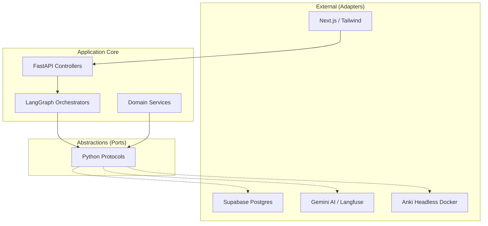
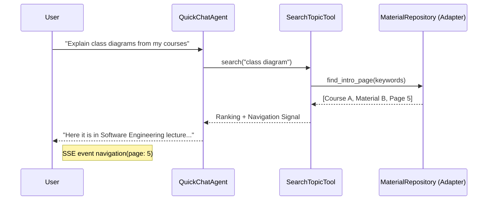
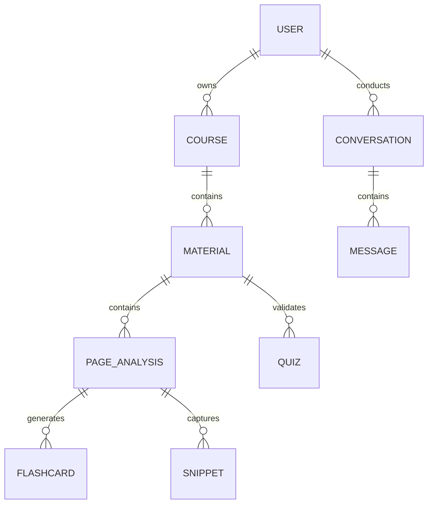

# StudyBuddy — System Design Specification

> **Scope**: Production-grade architectural modeling grounded in SOLID, Design by Contract, and proper abstraction.  
> Inputs: [ANALYSIS_AND_ARCHITECTURE_REPORT.md](file:///C:/Users/Louis/.gemini/antigravity/brain/9b019e47-c363-44f5-b62f-54816fcb0a49/ANALYSIS_AND_ARCHITECTURE_REPORT.md) | [FEATURE_SPECIFICATION.md](file:///C:/Users/Louis/.gemini/antigravity/brain/9b019e47-c363-44f5-b62f-54816fcb0a49/FEATURE_SPECIFICATION.md)

---

## 1. SOLID Analysis

### 1.1 Current Violations

| Principle | Violation Severity | Evidence in Codebase | Fix Strategy |
|---|---|---|---|
| **S**RP | 🔴 Critical | `storage.py` (89 functions) combines persistence, business logic, Anki sync, and task management. | Extract `Repository` (Anki, Material, User) and `DomainServices`. |
| **O**CP | 🟠 High | Adding a new agent type requires modifying `initiate_chat()` conditionals. | Implement `StudyAgent` Protocol and Registry pattern. |
| **L**SP | 🟡 Medium | Direct Supabase coupling inhibits testing with In-Memory/SQLite mocks. | Dependency Inversion with Interface-based repository adapters. |
| **I**SP | 🟠 High | Tools import the entire `storage.py` even if they only need one lookup function. | Split Storage into focused Protocols (Readers, Writers). |
| **D**IP | 🔴 Critical | `tutor_agent.py` directly imports concrete `storage.py` modules. | Constructor Injection with type-hinted Protocols. |

### 1.2 Fixed State: SOLID Compliance

1.  **Single Responsibility**: `FlashcardAgent` only orchestrates. Card saving is delegated to an `AnkiAdapter`. Progress tracking to a `TaskObserver`.
2.  **Open/Closed**: New functionality (e.g., "Summarization Agent") is added by implementing a `Protocol`. The core graph logic remains untouched.
3.  **Liskov Substitution**: `SupabaseMaterialRepository` and `MockMaterialRepository` share the same `Protocol` and are interchangeable in unit tests.
4.  **Interface Segregation**: `QuickChatAgent` only sees `SearchableContentReader`, not the card creation or quiz logic.
5.  **Dependency Inversion**: High-level agents depend on abstractions. Concrete Supabase logic depends on those same abstractions (Adapters).

---

## 2. Design by Contract (DbC)

We enforce behavior across layer boundaries using Python **Protocols** and **Pydantic Models**.

### 2.1 Domain Models (Contracts)
All inter-layer communication uses strictly typed Pydantic models.

```python
class PageAnalysis(BaseModel):
    id: UUID
    summary: str
    key_terms: List[str]
    # [...] enforced across Storage, Service, and Agent layers
```

### 2.2 Protocols (The "Ports")

#### Repository Ports
```python
class MaterialRepository(Protocol):
    def get_analysis_by_page(self, material_id: UUID, page_num: int) -> PageAnalysis: ...
    def save_material_summary(self, material_id: UUID, summary: str) -> None: ...
```

#### Service Ports
```python
class AnkiService(Protocol):
    """Contract: Syncs cards to Anki Desktop/Web"""
    def sync_cards(self, cards: List[Flashcard]) -> SyncResult:
        """Pre: len(cards) > 0. Post: All cards exist in Anki."""
        ...
```

---

## 3. High-Level Architecture (C4 Model)

### 3.1 Context View
- **User**: Interacts via Next.js Frontend.
- **StudyBuddy System**: Orchestrates AI Agents.
- **External Dependencies**: 
  - Gemini API (Intelligence)
  - Supabase (Storage/Auth)
  - AnkiConnect (Flashcard Management)
  - Langfuse (Observability)

### 3.2 Container View (Clean Architecture)

We adopt the **Ports & Adapters (Hexagonal)** pattern:



---

## 4. Sequence Diagrams

### 4.1 Hybrid Search & Navigation (QuickChat)


## 5. Protocol Definition Catalog

The system is decoupled via **13 core Protocols**. This enables parallel development and comprehensive testing via Mocks.

| Component | Protocol | Responsibility |
|---|---|---|
| **Storage** | `PageAnalysisReader` | Fetching granular slide data. |
| **Storage** | `CourseRepository` | CRUD for course/material metadata. |
| **Storage** | `ChatHistoryManager` | Loading/saving LangGraph state & messages. |
| **Search** | `VectorStoreSearcher` | Hybrid semantic search. |
| **Anki** | `AnkiGateway` | Syncing to AnkiDesktop/Web. |
| **Quiz** | `QuizGenerator` | Creating multiple-choice comprehension checks. |
| **AI** | `StudyAgent` | Standard interface for Tutor, QuickChat, Flashcard agents. |

### 5.1 Protocol: PageAnalysisReader
```python
class PageAnalysisReader(Protocol):
    def get_analysis(self, material_id: UUID, page: int) -> Optional[PageAnalysis]: ...
    def get_material_overview(self, material_id: UUID) -> str: ...
```

### 5.2 Protocol: AnkiGateway
```python
class AnkiGateway(Protocol):
    def test_connection(self) -> bool: ...
    def upsert_deck(self, name: str) -> None: ...
    def push_cards(self, cards: List[Flashcard]) -> None: ...
```

---

## 6. Dependency Injection Strategy

We eliminate `import storage` from agents using **Constructor Injection** and FastAPI `Depends()`.

### 6.1 Container Pattern
We use a lightweight `Container` or `Registry` to bind Protocols to concrete Adapters.

```python
# infrastructure/registry.py
def get_material_repo() -> MaterialRepository:
    return SupabaseMaterialRepository(client=supabase_client)

# api/deps.py
def get_tutor_agent(repo: MaterialRepository = Depends(get_material_repo)):
    return TutorAgent(material_service=repo)
```

---

## 7. Data Modeling (ER Diagram)

The schema is optimized for **hierarchical study context**.



### 7.1 Key Tables

1.  **page_analyses**: Stores Gemini output. Vector column `embedding` optimized for hybrid search (F-5.2).
2.  **course_materials**: Stores PDF metadata + material-wide summary.
3.  **messages**: Relational history storage. Links to `page_analyses` for navigation context.

---

## 8. Agentic Design Patterns

### 8.1 State-Aware Tool Injection (F-2.7)
Unlike generic agents, StudyBuddy's nodes intercept tool calls to inject current state (material_id, page). This prevents LLM hallucination of identifiers.

### 8.2 Parallel Skip Evaluation (F-3.4)
The FlashcardAgent performs N-page skip decisions in parallel via `ThreadPoolExecutor` to minimize latency during the classification phase.

### 8.3 Incomplete Tool Call Patches (F-2.10)
A layer-specific middleware that fixes Gemini-specific message ordering violations before persistence.

---

## 9. Deployment & Operations

### 9.1 Containerization
- **Backend**: FastAPI (Python 3.11+)
- **Anki**: Anki-Headless (Docker container with AnkiConnect)
- **Database**: Supabase (Postgres + pgvector)

### 9.2 Observability
Full observability via **Langfuse**. Every agent step, tool call, and token count is traced with `user_id` and `material_id` metadata.

---

## 10. Design Decisions (ADRs)

| ADR | Decision | Rationale |
|---|---|---|
| 001 | **LangGraph over raw LangChain** | State management and cyclical logic (tools -> model) are more robust in graphs. |
| 002 | **SSE for Chat** | Streaming provides immediate feedback for multi-paragraph AI explanations. |
| 003 | **Anki Headless Docker** | Decouples study from local Anki installation, enabling SaaS deployment. |
| 004 | **Protocols (DbC)** | Enables swapping Supabase for Postgres/Redis without changing agent logic. |
| 005 | **Gemini multimodal** | Essential for slide analysis (OCR is insufficient for diagrams/charts). |

<!-- PART_3 -->

